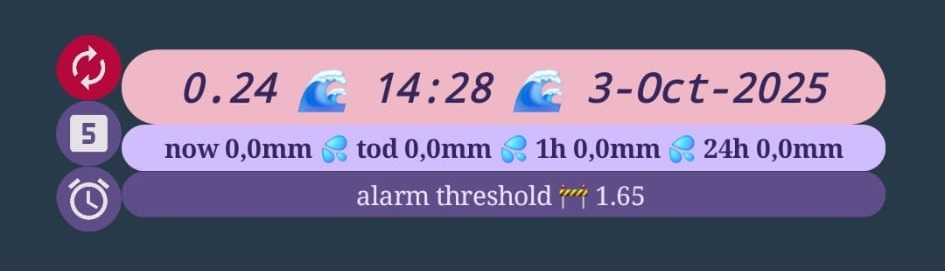

# CheckLevelTaro

This project has been done to fetch data from the web about the level of the local river Tarò in Meda-MB-Italy, and trigger an alarm when it gets to a critical threshold, possibly resulting in floods.
Main application is the activation during the night to wake up in case of emergencies (phone needs to be connected to the internet).

Many thanks to our fellow citizen that [publicly shares data from its meteo station](https://www.stefanocolombo.com/public/meteo/webtaro.php).

## Prerequisites
+ Download [Tasker](https://play.google.com/store/apps/details?id=net.dinglisch.android.taskerm&hl=it) and [AutoTools](https://play.google.com/store/search?q=autotools&c=apps&hl=it).
> [!WARNING]
> These tools need access and privileges to your phone to change system settings and run tasks.

## Usage
+ Create a Tasker Widget-v2 and place it on one of your Android desktops, and name it `CheckLevelTaroWidget`. Best if size is 5x1.
+ Download [`CheckLevelTaro.prj.xml`](CheckLevelTaro.prj.xml) project file from this repository and import it in Tasker.
+ Manually run `CheckLevelTaro` task in Tasker/tasks page to render the widget for the first time.

Your widget will look like this:

The main part is composed by 3 stripes:
+  Data fetched from web: river water level [m], time when data was last updated, date when data was last updated.
+  Data fetched from web: current rainfall [mm], today rainfall [mm], last 1h rainfall [mm], last 24h rainfall [mm].
+  Water level threshold [m] currently set by the user to trigger the alarm (interactive: by clicking here you can set a new threshold value).

On the left, there are 3 icons:
+  - Refresh data manually.
  +  Always.
+  - Enable automatic data fetching every 5 minutes.
  +  Active.
  +  Inactive.
+  -  Enable audio alarm to trigger at maximum volume if current river level is higher than programmed threshold, and if automatic data fetching is active.
  +  Active.
  +  Inactive.

> [!IMPORTANT]
> Edit `AlarmON` task, and make sure that `Music Play` action is pointing to an available `.mp3` file in your phone.

## Developer notes
This is my first Tasker application so it might not be perfect (but it works...).

It is composed by:
+ 1 Profile:
  + `CheckLevelTaro5minProfile`: every 5 min, it triggers the `CheckLevelTaro` task.
    + Icon  toggles this profile to be enabled via the `ToggleThisProfile` task.
+ 6 Tasks:
  +  `CheckLevelTaro`:
  +  `AlarmON`:
  +  `AlarmOFF`:
  +  `ToggleThisProfile`:
  +  `ToggleAlarm`:
  +  `SetThreshold`:
+ 2 Scenes:
  + `PopupInputTh`: new screen/popup that allows you to set a new threshold to be checked against river level. It shows up when you click on the third main stripe .
  + `PopupAlarm`: new screen/popup that shows up whenever the river level crosses the programmed threshold. It features a text message that close the popup when clicked.
    + Icon  toggles this popup to be enabled.
+ 4 Variables:
  + `%Enabled_data_var_col` and `%Enabled_alarm_var_col` to store icon colors respectively for  and .
  + `%Level_th` to store programmable threshold level.
  + `%ToggleAlarm` to store if alarm is enabled or not (no need to do this for automatic data parsing, since the `%PENABLED`(profiles enabled) Tasker variable can be used).
